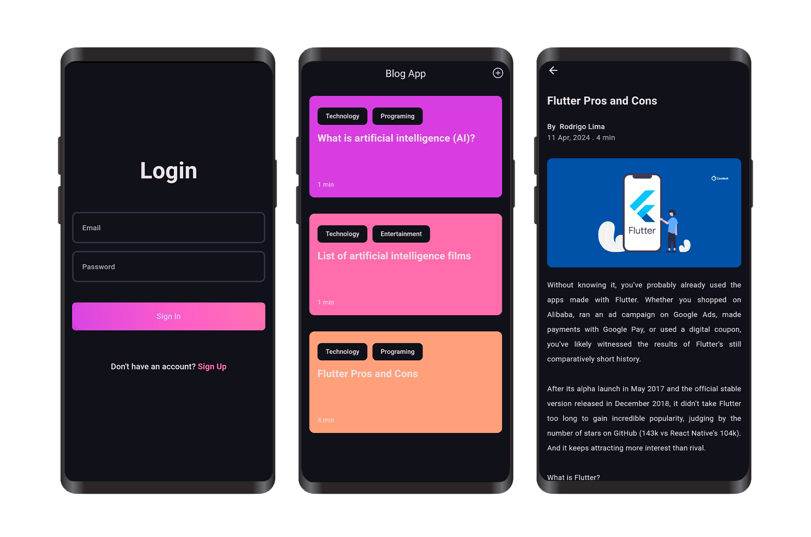

&nbsp;&nbsp;
&nbsp;&nbsp;
&nbsp;&nbsp;


# Blog App
### "Blog App" is a app developed using Clean Architecture principles. This app offers essential features including user authentication with login and sign-up functionalities, enabling secure access to the platform. Users can seamlessly navigate through the app to view existing blogs and create their own, fostering a dynamic blogging environment. With its clear and modular architecture, "Blog App" ensures scalability and maintainability for future enhancements and contributions.



<p align="center">
  <a href="https://drive.google.com/file/d/1kZlUATuymR2gzf19FJu_F9FP0uTEmVRP/view?usp=sharing">
    
  </a>
</p>


## Core Features:
* <span style="font-weight:bold; font-size: 18; color: white">Login: </span> 
<span style="font-weight:600; font-size: 15;">User can log in into the app.</span>

* <span style="font-weight:bold; font-size: 18; color: white">Sign Up:</span>
<span style="font-weight:600; font-size: 15;">User can create an account.</span> 

* <span style="font-weight:bold; font-size: 18; color: white">View All Blogs:</span>
<span style="font-weight:600; font-size: 15;">User can see all blogs created.</span> 

* <span style="font-weight:bold; font-size: 18; color: white">Create a blog:</span>
<span style="font-weight:600; font-size: 15;">User can create their own blog.</span> 
<br>

<br>

## Dependencies
<details>
     <summary> Click to expand </summary>

* [flutter_modular](https://pub.dev/packages/flutter_modular)
* [dartz](https://pub.dev/packages/dartz)
* [firebase_core](https://pub.dev/packages/firebase_core)
* [firebase_auth](https://pub.dev/packages/firebase_auth)
* [cloud_firestore](https://pub.dev/packages/cloud_firestore)
* [firebase_storage](https://pub.dev/packages/firebase_storage)
* [flutter_mobx](https://pub.dev/packages/flutter_mobx)
* [mobx](https://pub.dev/packages/mobx)
* [dotted_border](https://pub.dev/packages/dotted_border)
* [image_picker](https://pub.dev/packages/image_picker)
* [uuid](https://pub.dev/packages/uuid)
* [intl](https://pub.dev/packages/intl)
* [internet_connection_checker_plus](https://pub.dev/packages/internet_connection_checker_plus)
* [hive](https://pub.dev/packages/hive)
* [isar_flutter_libs](https://pub.dev/packages/isar_flutter_libs)
* [path_provider](https://pub.dev/packages/path_provider)

</details>
<br>
<br>

## Directory Structure
<details>
     <summary> Click to expand </summary>

```
lib
│   app_module.dart
│   app_widget.dart
│   firebase_options.dart
│   initial_page.dart
│   main.dart
│
├───core
│   │   core.dart
│   │   core_module.dart
│   │
│   ├───common
│   │   │   common.dart
│   │   │
│   │   ├───entities
│   │   │       entities.dart
│   │   │       user_entity.dart
│   │   │
│   │   ├───store
│   │   │       app_user_store.dart
│   │   │       app_user_store.g.dart
│   │   │       store.dart
│   │   │
│   │   ├───utils
│   │   │       calculate_reading_time.dart
│   │   │       format_date.dart
│   │   │       pick_image.dart
│   │   │       show_custom_snackbar.dart
│   │   │       utils.dart
│   │   │
│   │   └───widgets
│   │           loader_widget.dart
│   │           widgets.dart
│   │
│   ├───constants
│   │       constants.dart
│   │
│   ├───errors
│   │       errors.dart
│   │       exceptions.dart
│   │       failures.dart
│   │
│   ├───network
│   │       connection_checker.dart
│   │       network.dart
│   │
│   ├───theme
│   │       app_pallete.dart
│   │       app_theme.dart
│   │       theme.dart
│   │
│   └───usecases
│           usecase.dart
│           usecases.dart
│
└───features
    ├───auth
    │   │   auth.dart
    │   │   auth_module.dart
    │   │
    │   ├───data
    │   │   │   data.dart
    │   │   │
    │   │   ├───datasources
    │   │   │       auth_remote_datasource.dart
    │   │   │       auth_remote_datasource_impl.dart
    │   │   │       datasources.dart
    │   │   │
    │   │   ├───models
    │   │   │       models.dart
    │   │   │       user_model.dart
    │   │   │
    │   │   └───repositories
    │   │           auth_repository_impl.dart
    │   │           repositories.dart
    │   │
    │   ├───domain
    │   │   │   domain.dart
    │   │   │
    │   │   ├───repositories
    │   │   │       auth_repository.dart
    │   │   │       repositories.dart
    │   │   │
    │   │   └───usecases
    │   │           current_user_usecase.dart
    │   │           login_user_usecase.dart
    │   │           sign_up_user_usecase.dart
    │   │           usecases.dart
    │   │
    │   └───presenter
    │       │   presenter.dart
    │       │
    │       ├───pages
    │       │       login_page.dart
    │       │       pages.dart
    │       │       signup_page.dart
    │       │
    │       ├───store
    │       │       auth_store.dart
    │       │       auth_store.g.dart
    │       │       store.dart
    │       │
    │       └───widgets
    │               auth_button_widget.dart
    │               auth_field_widget.dart
    │               login_page_body.dart
    │               page_change_text.dart
    │               signup_page_body.dart
    │               widgets.dart
    │
    └───blogs
        │   blogs.dart
        │   blogs_module.dart
        │
        ├───data
        │   │   data.dart
        │   │
        │   ├───datasources
        │   │       datasources.dart
        │   │       local_blog_datasource.dart
        │   │       local_blog_datasource_impl.dart
        │   │       remote_blog_datasource.dart
        │   │       remote_blog_datasource_impl.dart
        │   │
        │   ├───models
        │   │       blog_model.dart
        │   │       models.dart
        │   │
        │   └───repositories
        │           blog_repository_impl.dart
        │           repositories.dart
        │
        ├───domain
        │   │   domain.dart
        │   │
        │   ├───entities
        │   │       blog_entity.dart
        │   │       entities.dart
        │   │
        │   ├───repositories
        │   │       blog_repository.dart
        │   │       repositories.dart
        │   │
        │   └───usecases
        │           get_all_blogs_usecase.dart
        │           upload_blog_usecase.dart
        │           usecases.dart
        │
        └───presenter
            │   presenter.dart
            │
            ├───pages
            │       add_new_blog_page.dart
            │       blogs_page.dart
            │       blog_viewer_page.dart
            │       pages.dart
            │
            ├───store
            │       blog_store.dart
            │       blog_store.g.dart
            │       store.dart
            │
            └───widgets
                │   widgets.dart
                │
                ├───add_new_blog_page
                │       add_new_blog_page.dart
                │       add_new_blog_page_body.dart
                │       blog_editor_widget.dart
                │       blog_topics_widget.dart
                │       image_selector_widget.dart
                │
                ├───blogs_page
                │   │   blogs_page.dart
                │   │   blogs_page_body.dart
                │   │
                │   └───blog_card
                │           blog_card.dart
                │           blog_card_widget.dart
                │           card_topics_widget.dart
                │
                └───blog_viewer_page
                        blog_viewer_page.dart
                        blog_viewer_page_body.dart
```

</details>
